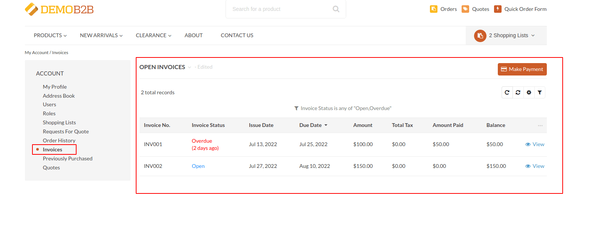
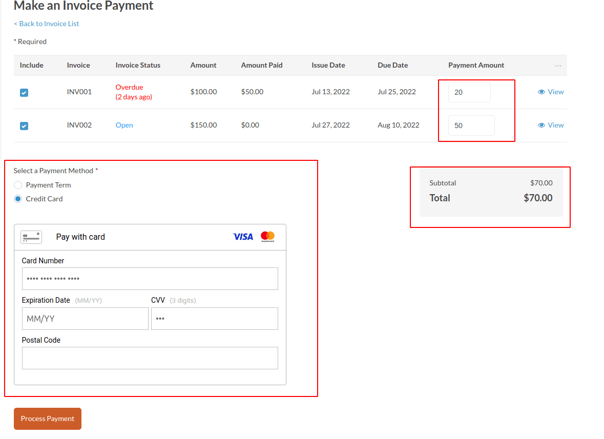
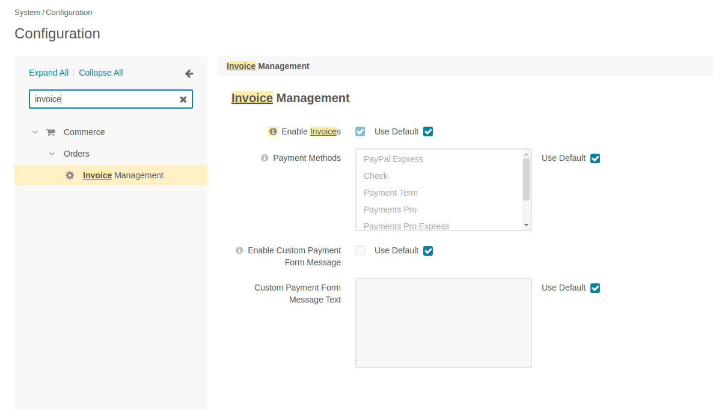

Aligent OroCommerce Invoices Bundle
==============================
This Bundle adds the ability for Customers to View/Pay Invoices for Storefront Customer Portal.





Features
-------------------
* Customers can List, Filter, and View their Open/Paid/Overdue Invoices
* Invoices are automatically marked as Overdue after Due Date has elapsed
* Customers can make Payments against one or more Invoices
* Customers can pay custom Amounts against each Invoice
* The allowed Payment Methods for Invoices can be configured
* Custom message can be displayed on Payment form
* Successful Invoice Payment amounts are automatically subtracted from the remaining Invoice balance
* Invoices are automatically marked as Paid after the full balance is successfully paid
* Invoices can be Listed, Filtered, and Viewed in the Oro Backoffice (admin) panel, including associated Invoice Payments
* Invoices Feature can be switched off globally or per-Website
* Access to Invoices and Payments can be controlled via Customer User Role (ACL) permissions

Requirements
-------------------
- OroCommerce 5.0


Important Notes/Caveats
-------------------
* Invoices are entirely standalone entities, they currently have no relationship to Oro Orders or the Checkout, or the Payment Term method.
* Invoices can currently only be created using the API (e.g. pushing Invoices into Oro from a third-party system), 
  or by Oro customization. 
* The Balance Remaining against each Invoice is only updated using the amount of the current successful Invoice Payment, 
  not the sum total of all Invoice Payments in Oro (so that the total amount paid against each invoice can be set via the API).
  This allows support for offline/external payments.
* This bundle **does not** currently trigger email notifications (e.g. Invoice Created, Invoice Due/Overdue, InvoicePayment Confirmation).
* Payment Methods which redirect to external payment forms (e.g. PayPal Express) may not be supported, they have not been tested.
* Invoice Payments are flagged `active: true`, this is updated to `active: false` once a successful `PaymentTransaction` has been made.

Installation and Usage
-------------------
**NOTE: Adjust instructions as needed for your local environment**

### Installation
Install via Composer
```shell
composer require aligent/orocommerce-invoices-bundle
```

Once installed, run platform update to perform the installation:
```shell
php bin/console oro:platform:update --env=prod
```

### Configuration
Once installed, visit `System Configuration => Commerce => Orders => Invoice Management`.


From here it is possible to enable/disable the Invoices feature, 
select the available Payment Methods for Invoice Payments, and optionally display
a custom message on the Invoice Payment form.


Database Modifications
-------------------
### Database Tables Created
* `aligent_invoice` - holds Invoices (`Invoice`)
* `aligent_invoice_line_item` holds Invoice Line Items (`InvoiceLineItem`)
* `aligent_invoice_payment` holds Invoice Payments (`InvoicePayment`)
* `aligent_invoice_payment_line_item` holds Invoice Payment Line Items (`InvoicePaymentLineItem`)
* `oro_enum_invoice_status` holds Invoice Status enum values (`Extend\Entity\EV_Invoice_Status`)


Sample API Payloads
-------------------
### Create New Invoice
`POST /admin/api/aligentinvoices`

```json
{
    "data": {
        "type": "aligentinvoices",
        "id": "new-invoice-'1",
        "attributes": {
            "invoiceNo": "INV-413",
            "issueDate": "2022-06-01",
            "dueDate": "2022-07-01",
            "amount": "100.0000",
            "currency": "AUD",
            "totalTax": "11.11",
            "amountPaid": "80.0000",
            "createdAt": "2022-06-01T16:15:20Z",
            "updatedAt": "2022-06-14T02:10:24Z"
        },
        "relationships": {
            "customer": {
                "data": {
                    "type": "customers",
                    "id": "7"
                }
            },
            "lineItems": {
                "data": [
                    {
                        "type": "aligentinvoicelineitems",
                        "id": "line-item-1"
                    },
                    {
                        "type": "aligentinvoicelineitems",
                        "id": "line-item-2"
                    }
                ]
            },
            "status": {
                "data": {
                    "type": "aligentinvoicestatuses",
                    "id": "open"
                }
            }
        }
    },
    "included": [
        {
            "type": "aligentinvoicelineitems",
            "id": "line-item-1",
            "attributes": {
                "amount": "25.0000",
                "currency": "AUD",
                "summary": "Line Item 1"
            }
        },
        {
            "type": "aligentinvoicelineitems",
            "id": "line-item-2",
            "attributes": {
                "amount": "75.0000",
                "currency": "AUD",
                "summary": "Line Item 2"
            }
        }
    ]
}
```


Core Overrides & Extensions
-------------------
None


Roadmap / Remaining Tasks
-------------------
- [x] OroCommerce 5.0 Support
- [x] Implement Unit Tests
- [ ] Update Payment Methods Configuration to use Rules instead of Methods ([#2](https://github.com/aligent/orocommerce-invoices-bundle/issues/2))
- [ ] Improve reliability/usability of Invoice Payment JavaScript components and SaveState feature
- [ ] Implement Demo Invoice Data Fixtures (using [aligent/oro-fixtures](https://github.com/aligent/oro-fixtures))
- [ ] Add ability to disable Invoice Payments globally (view-only mode)
- [ ] Implement Admin CRUD UI for Invoices with User Role ACL Permissions
- [ ] Automatically clean up old pending Invoice Payments (but preserve failed records)
- [ ] Ensure support for externally hosted Payment Methods (e.g. PayPal Express)

### Potential Future Enhancements
- [ ] Implement Payment Confirmation Emails 
- [ ] Automatically raise Invoices for OroCommerce Orders paid on Account (via Payment Term)
- [ ] Optionally Link Invoice Line Items to OroCommerce Orders
- [ ] Notifications (email and on-site) for Due/Overdue Invoices
- [ ] Oro Backoffice Dashboard Widgets (Due/Overdue Invoices)
